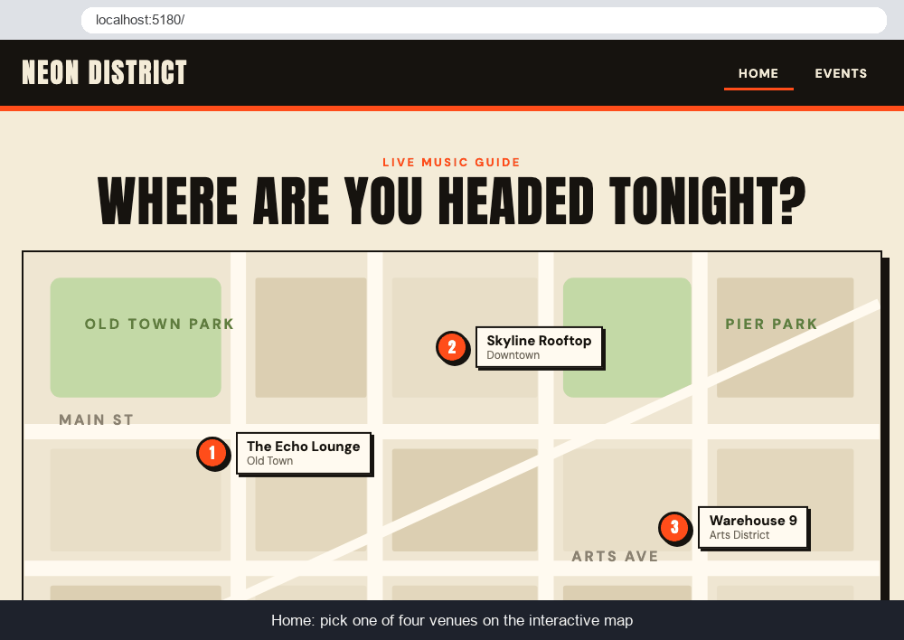

# WEB103 Project 3 - *Neon District*

Submitted by: **Dhimy Jean**

About this web app: **Neon District is a virtual community space for live music. Users click one of four venues on an interactive map and see every event (past and upcoming) at that venue, with a live countdown.**

Time spent: **2** hours

## Required Features

- [x] **The web app uses React to display data from the API**
- [x] **The web app is connected to a PostgreSQL database, with an appropriately structured `events` table**
  - [x] **The web app is connected to a Render PostgreSQL database**
  - [x] **The database contains an appropriately structured `events` table**
- [x] **The web app displays a title**
- [x] **Website includes a visual interface that allows users to select a location they would like to view**
- [x] **Each location has a detail page with its own unique URL** (`/locations/:id`)
- [x] **Clicking on a location navigates to its detail page and displays a list of all events from the `events` table associated with that location**

## Stretch Features

- [x] **An additional Events page shows all possible events** (`/events`)
- [x] **Users can sort or filter events by location**
- [x] **Events display a countdown showing the time remaining before that event**
- [x] **Events appear with different formatting when the event has passed** (struck-through, dimmed, "Ended ... ago")

## Video Walkthrough



GIF created with headless Google Chrome screenshots stitched together with Python (Pillow) — see `scripts/make-walkthrough.py`

## Database

Hosted on Render PostgreSQL. Tables live in a `vcs` schema. `locations` (id, name, neighborhood, image, description, x, y) and `events` (id, location_id → locations.id, title, description, event_date).

## Running it locally

1. Create a Postgres database on Render, copy `server/.env.example` to `server/.env`, and fill it in from the **Connections** panel (use the external hostname).
2. Seed the tables and start the API:

```bash
cd server
npm install
npm run reset
npm start
```

3. In a second terminal, start the frontend:

```bash
cd client
npm install
npm run dev
```

The API runs on http://localhost:3001 and the React app on the port Vite prints (usually http://localhost:5173).

## License

Copyright 2026 Dhimy Jean

Licensed under the Apache License, Version 2.0.
